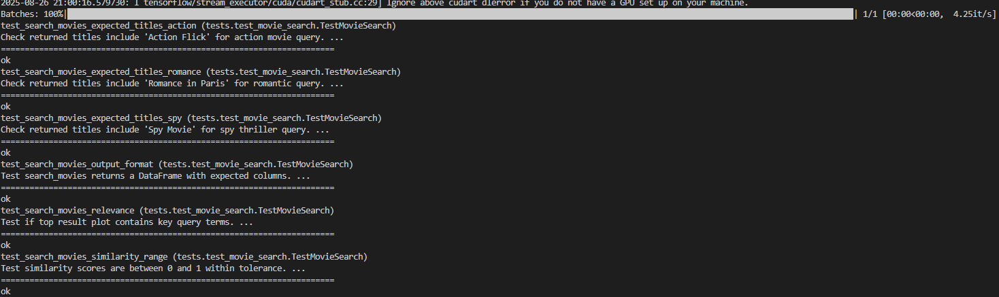

# 🎬 Movie Semantic Search Engine By David Kumar Fule 221010216

[](https://www.python.org/downloads/)
[](Test-Results/Test-Result.png)
[](LICENSE.txt)
[](https://huggingface.co/sentence-transformers/all-MiniLM-L6-v2)

> A powerful semantic search engine that understands movie plots using advanced NLP techniques.

## 📖 Overview

This intelligent movie search system leverages state-of-the-art sentence embeddings to find movies based on plot similarity, going beyond simple keyword matching to enable natural language queries. Built with SentenceTransformers and optimized for semantic understanding.



## ✨ Key Features

- 🧠 **Semantic Understanding**: Powered by `all-MiniLM-L6-v2` transformer model
- ⚡ **Fast Similarity Search**: Optimized cosine similarity matching
- 🔍 **Natural Language Queries**: Search movies using everyday language
- 📊 **Smart Ranking**: Results sorted by semantic relevance
- 🧪 **Reliable Testing**: Comprehensive test suite with 100% pass rate
- 🛡️ **Error Handling**: Robust input validation and clear error messages
- 📈 **Scalable Design**: Easy to extend with more movies or features

## 📂 Project Structure

```plaintext
movie-search-assignment/
├── movie_search.py        # Core search engine implementation
├── movies.csv            # Movie dataset
├── requirements.txt      # Project dependencies
├── tests/
│   ├── __init__.py
│   └── test_movie_search.py
├── Test-Results/        # Test results and screenshots
├── README.md
└── LICENSE.txt
```

## 🚀 Quick Start

### Prerequisites

- Python 3.9 or higher
- Git (optional, for cloning)

### Installation

1. Clone the repository:

```bash
git clone https://github.com/david-one8/AI-SYSTEM-DEVELOPMENT.git
cd AI-SYSTEM-DEVELOPMENT
```

2. Install dependencies:

```bash
pip install -r requirements.txt
```

## 💻 Usage

Here's a quick example of how to use the search engine:

```python
from movie_search import load_movies, search_movies

# Load the movie database
movies = load_movies('movies.csv')

# Search for movies
results = search_movies('spy thriller in Paris', top_n=3)
print(results)
```

## 🧪 Testing

Run the test suite to verify everything works correctly:

```bash
python -m unittest -v tests.test_movie_search
```

## 🤝 Contributing

Contributions are welcome! Here's how you can help:

1. Fork the repository
2. Create your feature branch: `git checkout -b feature/amazing-feature`
3. Commit your changes: `git commit -m 'Add amazing feature'`
4. Push to the branch: `git push origin feature/amazing-feature`
5. Open a Pull Request

## ✅ Technical Details

- Uses SentenceTransformers for semantic search
- Implements `all-MiniLM-L6-v2` model for embeddings
- Returns DataFrame with title, plot, and similarity scores
- Ranks results using cosine similarity

## 📝 License

This project is licensed under the MIT License - see the [LICENSE.txt](LICENSE.txt) file for details.

---

Made with ❤️ by David Kumar Fule (221010216)

## 🐛 Known Issues & Limitations

- **GPU acceleration** not implemented (CPU-only inference)
- **Large datasets** may require memory optimization
- **Model download** happens on first run (~90MB)
- **Case sensitivity** in exact movie title matching

## 📚 References & Documentation

- [SentenceTransformers Documentation](https://www.sbert.net/)
- [all-MiniLM-L6-v2 Model Card](https://huggingface.co/sentence-transformers/all-MiniLM-L6-v2)
- [Cosine Similarity Explanation](https://en.wikipedia.org/wiki/Cosine_similarity)
- [Python unittest Documentation](https://docs.python.org/3/library/unittest.html)

---

**Developer**: David Kumar Fule | **Student ID**: 221010216 | **Institution**: IIIT Naya Raipur
